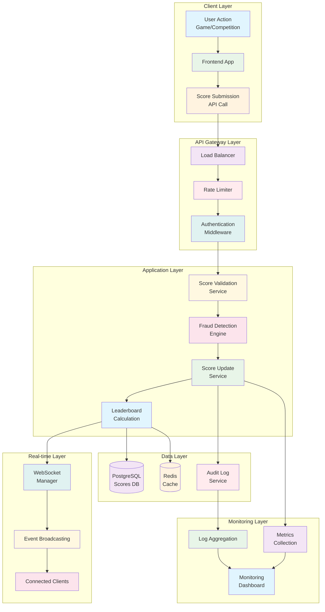
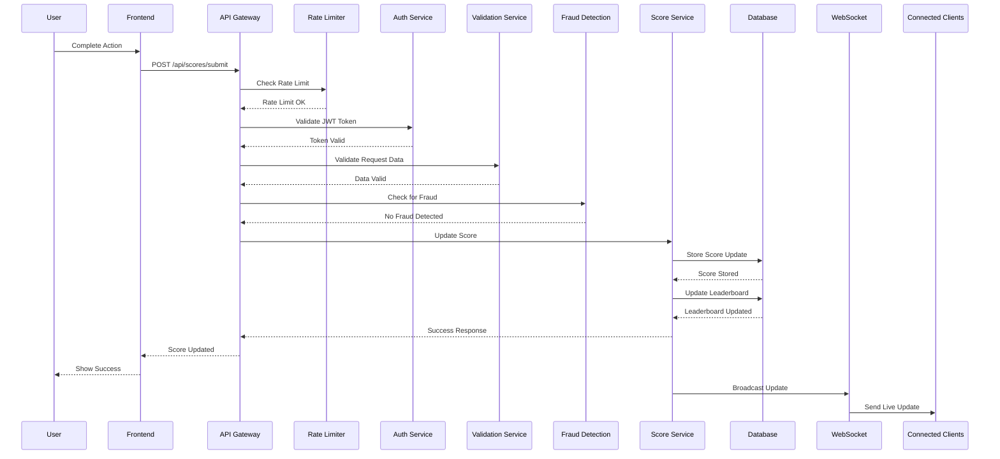
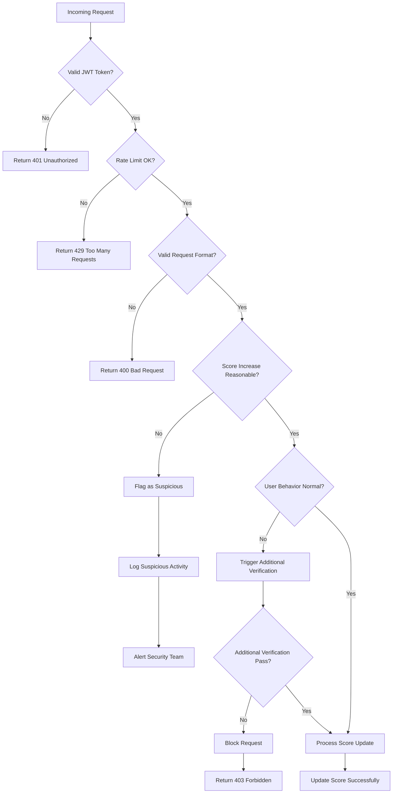
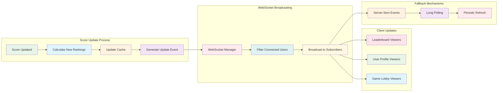
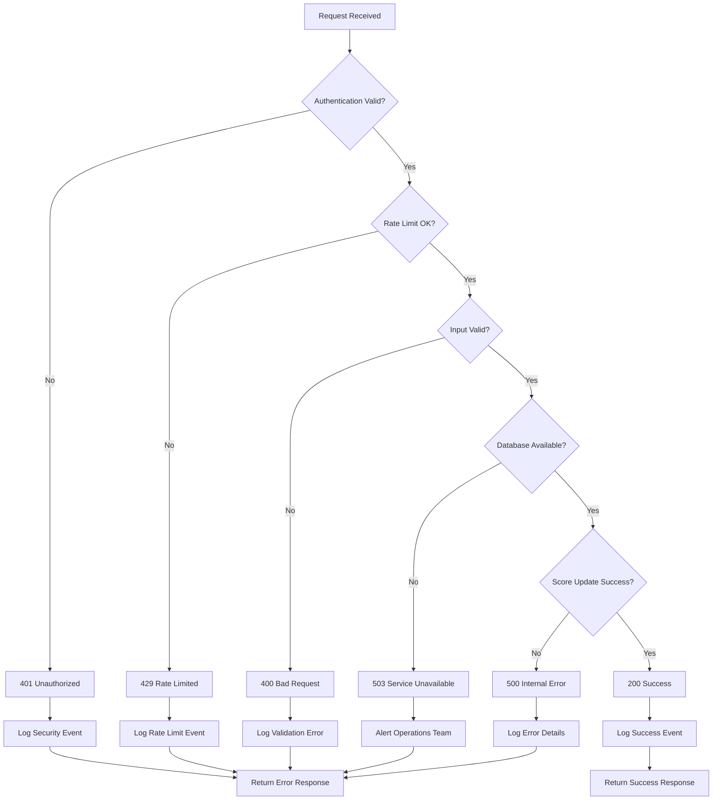
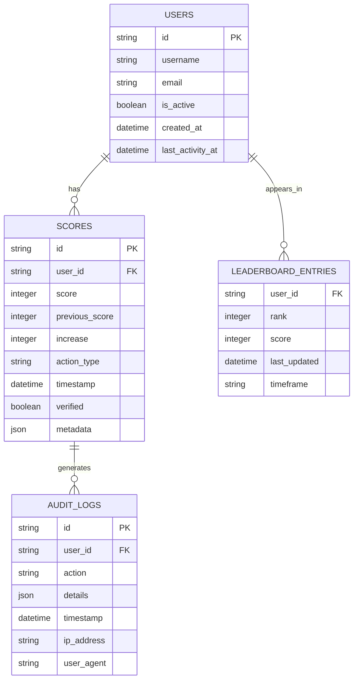
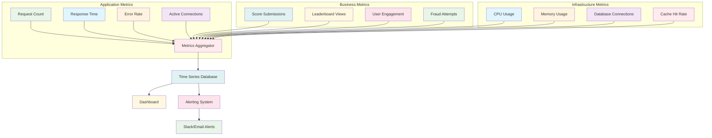

# Live Scoreboard API Service - Execution Flow Diagram

## System Architecture Flow

## Score Submission Flow

## Security & Validation Flow

## Real-time Update Flow

## Error Handling Flow

## Database Schema Relationships

## Performance Monitoring Flow

